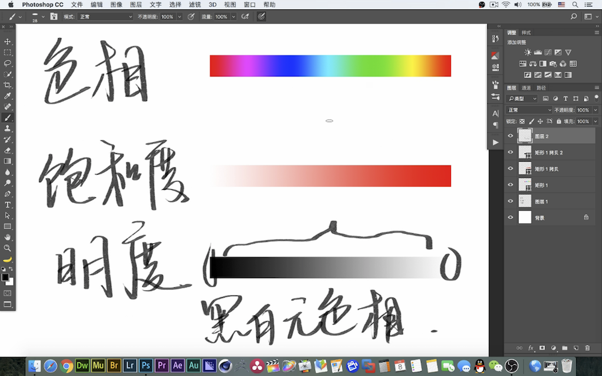
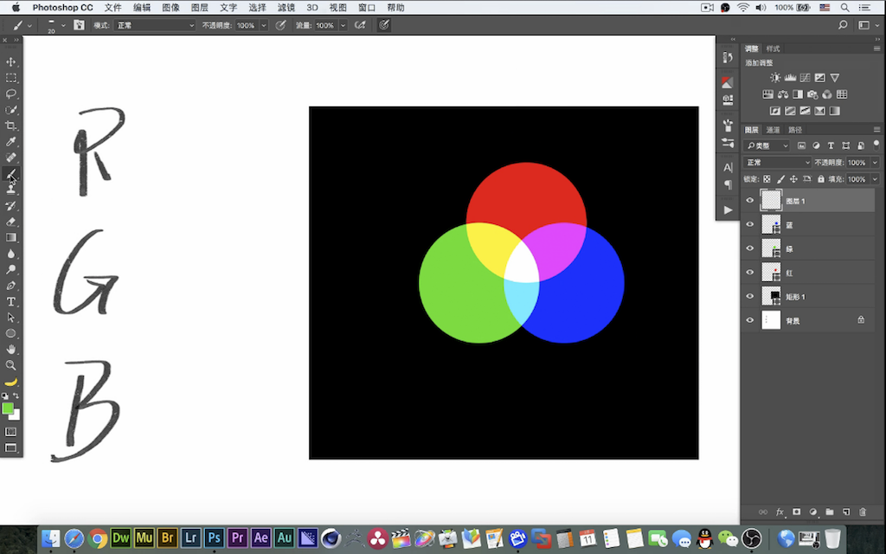

# Adobe（PS PR AE）影像后期全解

## 开班

注重影像后期、处理。

## Photoshop

### 基础 1 (PS 界面)

工具栏、属性栏、菜单栏。

1.  图层

- 移动工具 - 自动选择
- 显示/隐藏
- 多选 | 命名 | 标色 | 锁定
- 文件夹归类
- 思路
  - 新建与备份
  - 仿制

2.  工具栏 (扩展)

移动工具组:

- 移动工具
- 矩形选中 (蚂蚁线)
  - `shift` | `alt` | 配合自由变换 (`shift` + `alt`)
  - 仅可编辑选中部分
  - 单行 | 单列 (1 像素)
- 套索
- 快速选择与魔棒 (容差)
- 剪裁 (画布)
- 吸管工具 (前景色/背景色) (画笔 + `alt`)

绘画和修饰工具组:

- 画笔
  - `ctrl` + `alt` 大小(左右) | 软硬(上下)
  - 不透明度 (上限)
  - 流量 (下限)
- 修复工具
  - 污点修复工具
  - 修复画笔工具 (自定义采样源)
  - 修补工具 (先选择后采样)
  - 内容感知移动 (选择 + 采样 + 移动)
- 仿制图章工具 (不进行融合)
- 橡皮擦
- 渐变工具
- 涂抹工具 (模糊 | 锐化 | 涂抹)
- 减淡 | 加深 | 海绵 (去色)
- 历史记录画笔工具
  - 连续撤销 `ctrl` + `alt` + `z`
  - 设置记录点
  - 快照

矢量工具组:

- 钢笔工具
- 文字工具 (横排 | 竖排)
- 形状工具
- 路径工具

- 抓手 | 旋转
- 缩放工具 (左右)

### 基础 2 (像素、色彩)

1.  像素

- 图像的基础元素，一个像素(一个颜色)
- 像素 + 尺寸 = 分辨率 (e.g. 72 像素/英寸)
  - 网页 | 显示 72 DPI
  - 照片 | 印刷 300 DPI
  - 两次立方 vs 邻近
  - 像素一定时，分别率决定输出尺寸

2.  色彩

三要素: 色相、饱和度、明度。 (HSB)

- 色相(环) : 名称
  - 黑白无色相
- 饱和度(%) : 横向
- 明度(%) : 纵向

3.  调整层

- 色相/饱和度
  - 范围 (选定 + 渐变)
  - 着色 (针对灰色 | 黑白先改明度)

### 基础 3 (色彩原理、调色工具)

光的三原色 RGB 。混合模式，滤色(模拟光混合)。

CMYK: (kyan, magenta, yellow, key 青红黄黑 减色 印刷) 正片叠底。

RGB - CMY 对立色。(e.g. 红 + 青 = 黑)。

可选颜色工具。

色阶(直方图)。标尺(左右截断，中间调)。

曲线。

### 基础 4 (通道、蒙版)

原色通道 | Alpha 通道(选区、模糊、羽化) | 专色通道(烫金大字)

黑白灰。

蒙版 (e.g. 模糊 <-> 色阶提对比)。

分通道画透明物体。

### 调整工具

- 亮度/对比度 (配合直方图)
- 曝光度
- 自然饱和度
- 黑白 (细节层次感更好) | 去色
- 照片滤镜
- 通道混合器
- 反相
- 色调分离 (色阶 = 每通道颜色)
  - 柔焦镜头效果 (色调分离 + 明度 + 滤色)
- 阈值 (分黑白)
  - 版画效果 (高反差保留 + 阈值)
- 渐变映射 (渐变 -> 直方图)
- 阴影/高光
- HDR (细节多工业感)
- 匹配颜色 (源)
- 替换颜色
- 色调均化 (平均直方图)
- 色彩平衡 (e.g. 换脸)
- 颜色查找
  - Raw (宽容度、较多信息低对比度)
  - Log (~= 视频 RAW)
  - Lut (~= 颜色映射)
  - .dcp (Raw -> Log -> Lut)

### 混合模式、图层样式

1.  图层混合模式 | 画笔混合模式

- 背后、清除 (画笔)
- 溶解
- 变暗 (保留更暗的部分)
  - e.g. 正片叠底 [| 颜色加深 | 线性加深 | 深色]
- 变亮 (保留亮部)
  - e.g. 滤色
- 叠加 (中性灰分界，亮更亮暗更暗)
  - e.g. 柔光
  - 中性灰修图 (D&B 加深减淡)
  - 观察层 (黑白 + 强对比)
- 差值 (减色)
  - e.g. 排除 [| 减去 | 划分]
- 色相 | 饱和度 | 明度 | 颜色

2.  混合选项 (图层样式)

- 混合颜色带 (alt 控制过渡区域)
- 高级混合
  - 填充不透明度 (不影响样式)
  - RGB
  - 挖空 (深到底、浅到组)
- 样式 (预设)
- fx

### 滤镜

智能对象 (高级版的图层组) (e.g. 防止反复缩放造成的像素损失 | 风格化文字)。

- 滤镜库 (预设效果 | 图层叠加)
- 自适应广角 (广角畸变)
- 镜头校正
- 液化
- 消失点 (透视关系)

- 模糊
  - 高斯模糊 (平均)
  - 表面模糊 (阈值内范围不受模糊)
  - 动感模糊 (位移)
  - 镜头模糊 (灯光散景)
  - 平均 (图像均色)
- 模糊画廊 (高级版模糊)
  - 场景模糊
  - 光圈模糊
  - 移轴模糊
  - 路径模糊 (追焦)
  - 旋转模糊 (转轮)
- 扭曲
  - 极坐标 (小星球: 方形 | 垂直画布 | 位移对齐)
  - 切变 (高级位移)
  - 置换 (褶皱换装: 填充 -> 置换)
- 视频 (隔行扫描 -> 逐行扫描)
  - 1px \* 2px 定义图案
  - 填充
- 锐化 (增加细节对比度)
  - USM 锐化 (Lab 颜色 -> 锐化明度)
  - 质感 (更强烈的锐化，提升清晰度)
- 其他
  - 高反差保留 (中部转为中性灰不受混合模式[e.g. 线性光]影响 锐化 -> 质感 -> 对比度)
  - 自定 (e.g. `f(Σb) => b` | 模糊算法、锐化算法、高反差保留)
  - HSB/HSL (RGB -> HSB[处理低饱和度部分] e.g. 自然饱和度)
- 选择并遮住[| 调整边缘]

### 笔刷示例

1.  中性灰修图 (数位板)

- 观察层: 渐变映射 + 色阶[| 曲线]
- 添加中性灰填充图层 (柔光)

2.  自定义画笔

- 方形 -> 定义画笔预设
- 画笔属性
  - 笔尖 (间距 | 角度)
  - 形状抖动 (大小 | 角度)
  - 散布
  - 传递

3.  烟雾效果

- 色阶分离黑白(烟)
- 通道选中(抠图)
- 定义画笔预设
- 模糊 | 不透明度

### 矢量工具

位图记录单元格(像素)颜色，矢量记录点、线、面。钢笔 + `ctrl` [| 路径选择工具] 控制点。矢量形状无损放大。保存为 EPS 格式。

- 钢笔 + 调整边缘
- 字体 -> 形状 -> 路径选择

### 动作

e.g. 录制粗颗粒胶皮效果 (曲线 -> 滤镜 -> 色相/饱和度 -> 柔光中性灰[杂色+模糊] -> 亮度/对比度[手动])。

批处理 | 图像处理器 (动作)

### Camera RAW (滤镜)

> RAW 特点: 数字底片、标准不一、没有预设、不包含色彩管理空间 | 位深度 | 宽容度

- 白平衡 (#nnn)
- 渐变滤镜
- 径向滤镜
- 基本 (`alt` + 白色/黑色调整)
- 曲线
- 锐化 (`alt` + 蒙板)

## Bridge & Lightroom

图片、素材管理。**过滤器**。标星、标色、对比。

## Premiere

- 线性编辑 与 非线性编辑
- 帧率 (23.976 FPS)
- 场 (上下场、奇偶场，隔行扫描时代)
- 码率
- 时间轴
- 素材 <-> 序列 (编辑基础)
- 效果 <-> 效果控件
- CBR | VBR

- 向前选择
- 剃刀 (裁剪)
- 波纹 | 滚动 | 比率 编辑工具
- 外滑工具
- 钢笔工具 (调整关键帧)
- 切换同步锁定

### 示例

1.  压黑边

导出帧 -> 载入素材 -> PS -> 上下黑边 PNG

2.  调色

选择预设(Lumetri Color) -> 拖入时间轴 -> 效果控件 (窗口 Lumetri 范围 | 复制效果 | 调整图层 | 切换动画)

3.  代理文件

新建项目 -> 收录设置 -> 创建代理 (Encoder 转码) -> 按钮编辑器 (切换代理) -> 输出

4.  多机位剪辑

素材文件夹 -> 创建多机位源序列 (同步点 ? 出点、入点、音频)

5.  人声降噪

音频 -> 嵌套 -> 渲染并替换 -> Audition 降噪 -> 污点修复 [|捕捉、降噪] -> 标准化

---

## After Effects

能用 PR 的部分不进入 AE。常用功能: 动效、合成、跟踪、摄影机反求、抠像。

- 锚点对齐
- 关键帧
  - 关键帧辅助
  - 图表编辑器
  - 钢笔编辑
  - 单构尺寸
- 创建形状 [|蒙板] (选中图层)

- 预合成
- 冻结帧
- 跟踪器
  - 空对象
  - 父级
